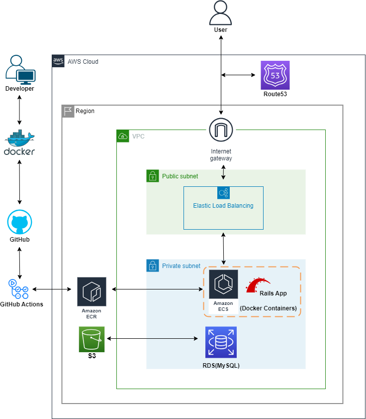

# 設計

## 業務フロー

[業務フロー](https://www.figma.com/file/u5v8q751cvRyZzKFZRNU5x/%E3%81%8C%E3%81%A3%E3%81%93%E3%81%86%E3%81%AB%E3%81%A3%E3%81%8D%E3%80%80%E6%A5%AD%E5%8B%99%E3%83%95%E3%83%AD%E3%83%BC?type=whiteboard&t=c8mVtQiE0R1Z1jdR-1)

## 画面遷移図

[画面遷移図](https://www.figma.com/file/pzpX2lYhJAuF45Uc6YKNxx/%E3%81%8C%E3%81%A3%E3%81%93%E3%81%86%E3%81%AB%E3%81%A3%E3%81%8D%E3%80%80%E7%94%BB%E9%9D%A2%E9%81%B7%E7%A7%BB%E5%9B%B3?type=design&mode=design&t=c8mVtQiE0R1Z1jdR-1)

## ワイヤーフレーム及び仕様詳細

[ワイヤーフレーム及び仕様詳細](https://zenn.dev/iranorih/articles/714de66aeffdde)

## テーブル設計

[テーブル設計](https://dbdiagram.io/d/new_school_diary-66459356f84ecd1d224fdba9)

## システム設計図

